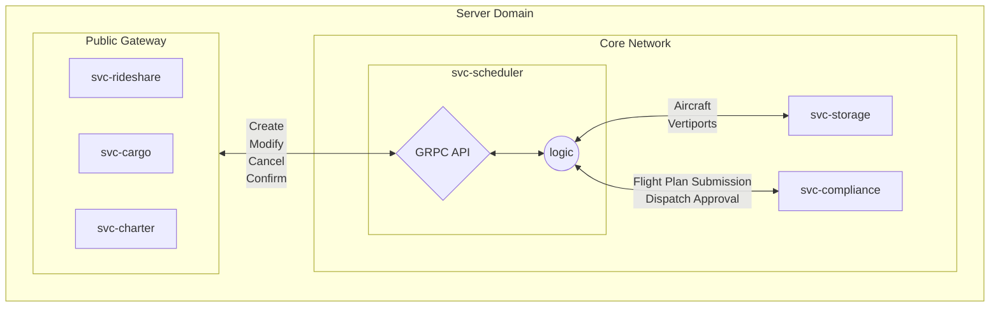

# Concept of Operations - `svc-scheduler`

## :telescope: Overview

:exclamation: This document is intended for internal use.

:exclamation: This document describes both current and *planned* capabilities. Not all features described in this document have been implemented.

### Metadata

| Attribute     | Description                                                       |
| ------------- |-------------------------------------------------------------------|
| Maintainer(s) | [Services Team](https://github.com/orgs/Arrow-air/teams/services) |
| Stuckee       | A.M. Smith ([@ServiceDog](https://github.com/servicedog))         |
| Status        | Development                                                       |

## :books: Related Documents

Document | Description
--- | ---
[High-Level Concept of Operations (CONOPS)](https://github.com/Arrow-air/se-services/blob/develop/docs/conops.md) | Overview of Arrow microservices.
[High-Level Interface Control Document (ICD)](https://github.com/Arrow-air/se-services/blob/develop/docs/icd.md)  | Interfaces and frameworks common to all Arrow microservices.
[Requirements - `svc-scheduler`](https://nocodb.arrowair.com/dashboard/#/nc/view/bdffd78a-75bf-40b0-a45d-948cbee2241c) | Requirements and user stories for this microservice.
[Interface Control Document (ICD) - `svc-scheduler`](./icd.md) | Defines the inputs and outputs of this microservice.
[Software Design Document (SDD) - `svc-scheduler`](./sdd.md) | Specifies the internal activity of this microservice.
[Routing Scenarios](https://docs.google.com/presentation/d/1Nt91KVIczhxngurfyeIJtG8J0m_38jGU1Cnqm1_BfPc/edit#slide=id.g1454d6dfbcf_0_731) | Graphical representation of various routing scenarios

## :raised_hands: Motivation

The scheduler service (`svc-scheduler`) is the center of the Arrow rideshare and cargo network.

This service routes aircraft between vertiports and manages (creates, modifies, confirms, and cancels) flight plans. Serving this goal requires a complex interweaving of fleet routing, vertipad scheduling, resource monitoring, and flight plan management.

There are a limited number of VTOL landing zones in the urban environment. While automobile rideshares may exchange passengers anywhere near the vicinity of the drop-off zone, urban VTOL aircraft must land on a regulated pad. Aircraft will occupy these pads for some duration, preventing others from landing and placing an upper limit on the number of aircraft in operation.

As an additional source of complexity, passengers may plan minutes, hours, or days in advance. In the on-demand case, potential routes should be calculated and presented to the client within a reasonable time frame (seconds or minutes) and stay viable long enough for the client to make a decision.

## Needs, Goals and Objectives of Envisioned System

The `svc-scheduler` service has several functions:
- Expose an API for other microservices to create, confirm, cancel, and modify flight plans.
- Fleet routing and optimization

## External Interfaces

This is a general overview of external interfaces and capabilities.

 

Explanation:
1) `svc-scheduler` obtains current aircraft and vertiport information from `svc-storage`.
2) Services make requests to `svc-scheduler`'s gRPC interface.
3) Aircraft selection and vertipad scheduling are performed by `svc-scheduler`.
4) `svc-scheduler` submits and obtains approval for flight plans from `svc-compliance`.

A full description of interfaces can be found in the [ICD](./icd.md).

## Nominal & Off-Nominal Conditions

Nominal and off-nominal conditions will be addressed by service-level requirements, which will link up to high-level requirements. These documents are still being developed.

## Modes of Operation

Mode | Description
--- | ---
Nominal | Accept all valid incoming requests.
Maintain | Forbid new flight requests, allow limited modifications and cancellations.
No-Fly | Ground all active flights to nearest available vertipad or emergency landing zone. Forbid new flight requests without proper permissions.
Offline | Unable to accept any type of request; dependencies unavailable.

## Physical Environment

See the High-Level Services CONOPS.

## Support Environment

See the High-Level Services CONOPS.

## Impact Considerations

See the High-Level Services CONOPS.

## Risks and Potential Issues

***Attack Vector***

As a service in the core network, this service will be probed by malicious attacks of various forms. Intruders may attempt to imitate other services in the local network (such as `svc-cargo` or `svc-storage`) to send false data or overwhelm the network.

***Accuracy***

While this service does not directly control aircraft, it can nevertheless create dangerous situations for pilots. In both nominal and emergency operations, overlapping vertipad reservations may lead to crowded airspace or collisions.

***Availability***

A failure of the service (power outage, process crash, server meltdown, etc.) could produce a situation where the scheduler is inactive during emergency scenarios or serious delays. An on-the-ground procedure needs to be established to be used during blackouts, unexpected network outages, and so on.

***Sensitive Data***

Users will request personal data through this service including ride history, vertiport defaults, and other sensitive information. Data traffic to and from this service should be encrypted for user privacy.

## Scheduling Variables

### Requests

When a service requests a flight, it must provide information about the trip.

| Input | Description |
| ----  | ---- |
| Departure and Arrival Vertiports | Each vertiport is associated with a unique alphanumeric identifier, and a human-readable label for easier discovery. For example, "(EMERGENCY) The Academic Medical Center. |
| Depart By/Arrive By | Clients will provide an "arrive by" or "depart by" time. This is needed by the scheduler to create a "departure window". Clients with overlapping departure windows may be combined onto a flight. |
| Cargo or Rideshare | Different vehicles and vertipads will be used for cargo operations and rideshare operations. |
| Pad Time | Estimated amount of time needed for loading and unloading.

### Vertiports

Vertiports have:
- Operational status (open/closed)
- Permissions (private, emergency-only)
- Coordinates
  - Static coordinates
  - Location stream (moving platforms)
- One or more **vertipads**

### Vertipads

A vertipad, or **pad** for short, is a landing zone for a VTOL aircraft. The size and visible markings of a pad are typically governed by government regulations.

A pad has:
- Operational status (enabled)
- Permissions (private, emergency-only)
  - These may override the owning vertiport's settings
- Charge capability (or none)
- Size

A pad can host a single aircraft at a time, and therefore must have a **pad schedule**.

### Vertipad Schedule

The pad schedule consists of dynamically sized time slots. The start of a time slot corresponds with the estimated arrival time of an aircraft. The size of a time slot is the estimated amount of time that the aircraft will occupy the pad. This value can be set by default, by request, or by the vertiport operator.

A time slot duration should allow for unloading, loading, battery swapping, and pre-flight checks. It also should be a break for a pilot to use the facilities, grab a coffee, or chat. Time slot durations should also include "padding" to allow for slightly late arrivals and departures.

Pilots may be allowed to petition `svc-scheduler` for an early departure, if the destination pad is available for an early landing. If an aircraft leaves a pad later than expected, it may have the option of increasing flight speed to arrive on-time at the destination.

In the off-nominal case that a flight fails to leave at its scheduled departure time *and* there are imminent inbound aircraft to the pad they occupy, there are several options.

***Re-route Incoming***

Ideally a vertiport has a vertipad used solely for backups and emergencies. In this case, incoming aircraft would be redirected to this backup pad until the delayed flight finally departs.

If there is no backup pad and the current aircraft is unable to be moved off of the pad, flights may re-route to the nearest alternate vertiport instead (at great inconvenience to the customer).

***Diminishing Delays***

Even a small delay at one vertipad has the power to propagate to the whole network and cause missed connections. Incoming flights can help get a vertipad schedule back on track through early departures. If five flights each leave one minute earlier than expected, they can collectively rectify a five minute delay caused by an earlier flight. `svc-scheduler` may enforce these smaller pad windows until a vertipad is on-time once again.

### Aircraft

Aircraft from multiple manufacturers may operate on the Arrow network. Different makes and models may have differing specifications, such as cargo capacity, range, and handicap accessibility.

These factors are considered by the scheduler when matching an aircraft to a flight plan, as well as proximity to the departure location at the departure time.

### Aircraft Charge

Aircraft have limited range on a single battery charge. The scheduler will calculate if an aircraft has sufficient charge to make a journey, based on the weight of cargo, distance, and current state of charge. The scheduler will also plan for extended pad occupation if an aircraft needs to recharge.

In the case of easily exchangeable power cells, the scheduler will determine the cells to be exchanged based on their charge levels, which can be obtained from networked charging stations.

### Regulatory Constraints

Regulations from civil aviation authorities will impact aircraft scheduling.

Government regulations may restrict VTOL aircraft to settled air “corridors”, each with multiple "lanes" at a strict altitude. Each lane may be limited in capacity.

Many countries require flight plans filed with the nearest flight authority prior to takeoff. In the case of airport operations, permission from airport dispatch may also be required prior to takeoff. `svc-scheduler` will communicate with `svc-compliance` to obtain these approvals.

Due to the low-flying nature of VTOL aircraft, government regulations may restrict aircraft to specific flight "corridors" between each pad. In this case, changing destination mid-flight (due to a medical emergency, for instance) may require a sequence of transfers between corridors, as opposed to simply changing direction. These regulations are still being developed.

### Environmental Factors

Scheduling may be impacted by inclement weather, including windy conditions and rain. The scheduler may factor wind speed into trip estimations, depending on the aircraft and activity level of the destination pad.

Specific weather conditions should disqualify flights. Circumstances of automatic disqualification are to be determined. Cancellation may be commanded by vertiport operators.

Vertiports and aircraft require a strong network connection to stay apprised of schedule changes. Downtime in the network may halt new flights, and a manual procedure for landing aircraft on pads will need to be followed in the event of network or electricity outages.

## Deployment

A dedicated `svc-scheduler` process will be deployed to each VTOL region. Regions will generally be focused around cities, towns, or test sites. The server hardware will optimally also be located in `svc-scheduler`'s region.

Regional scheduler processes will coordinate with one another to transfer an aircraft from one region to another. This would be the case in adjacent cities whose vertiport networks grow large enough to intersect. The schedulers will need to agree on the transfer to prevent an overabundance of aircraft in one region.

## Appendix A: Acronyms & Glossary

See the [Arrow Glossary](https://www.arrowair.com/docs/documentation/glossary).
