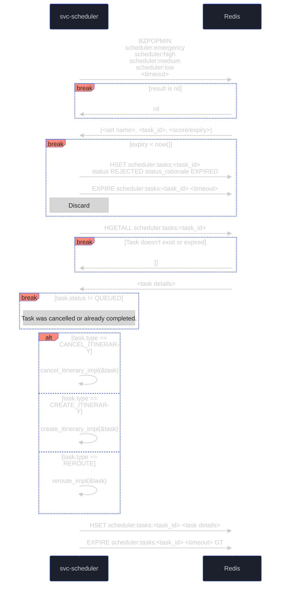
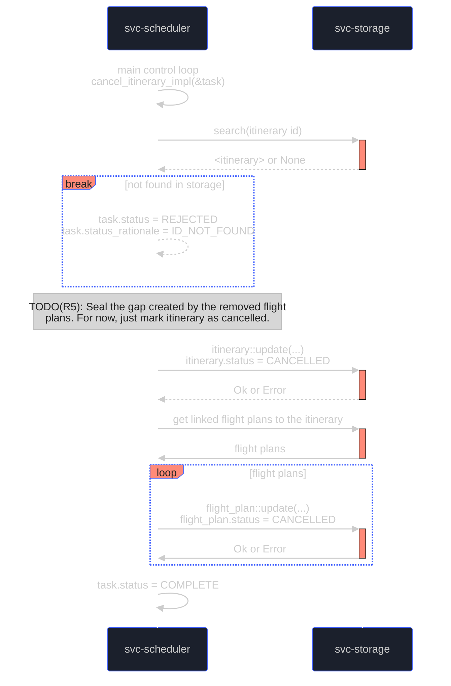
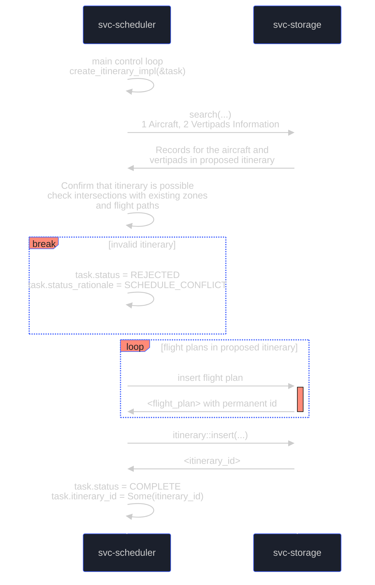
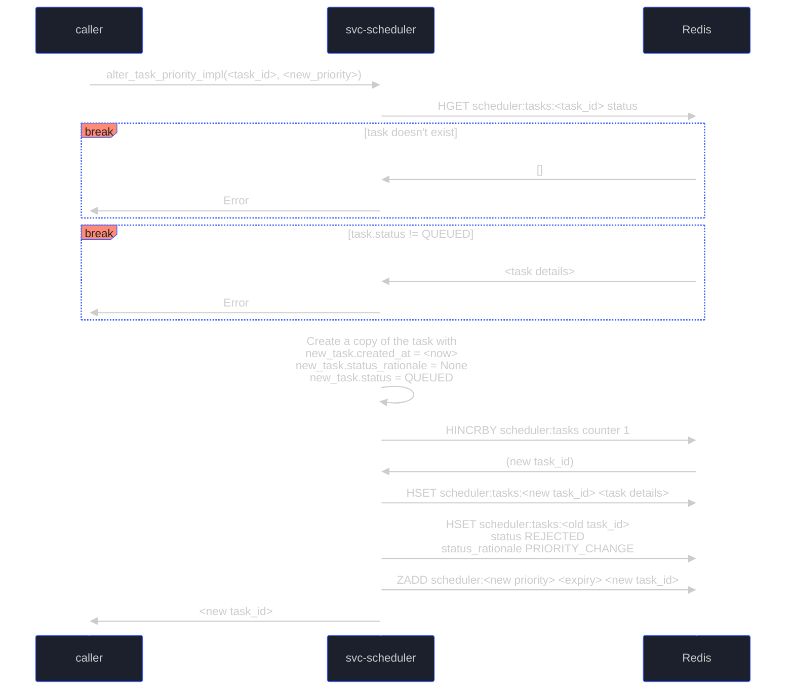
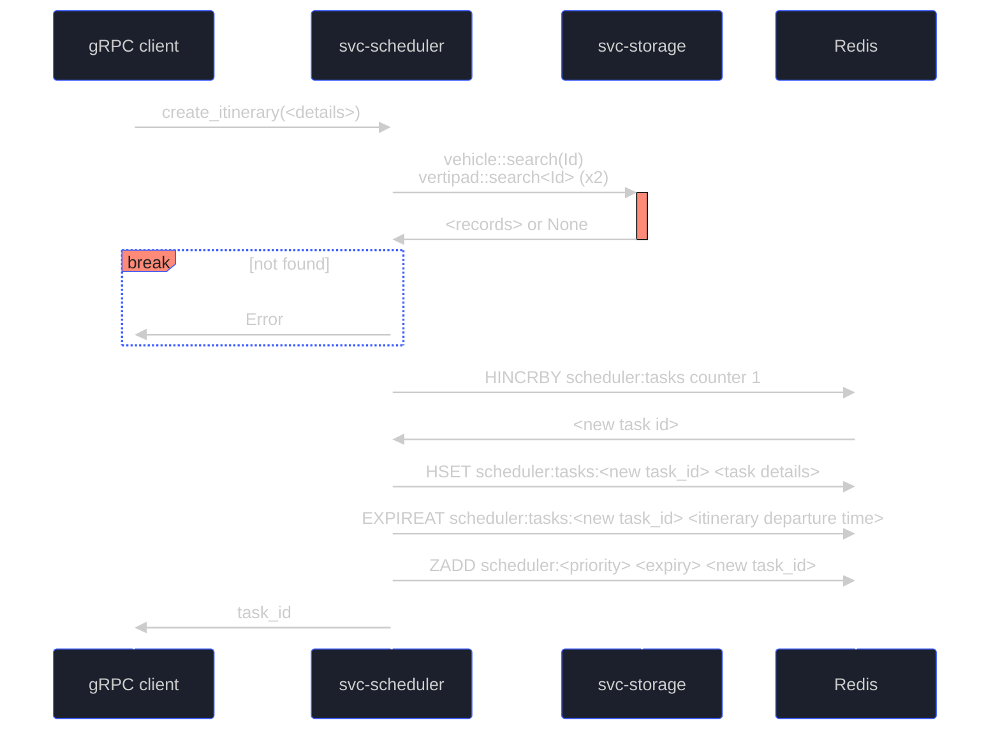
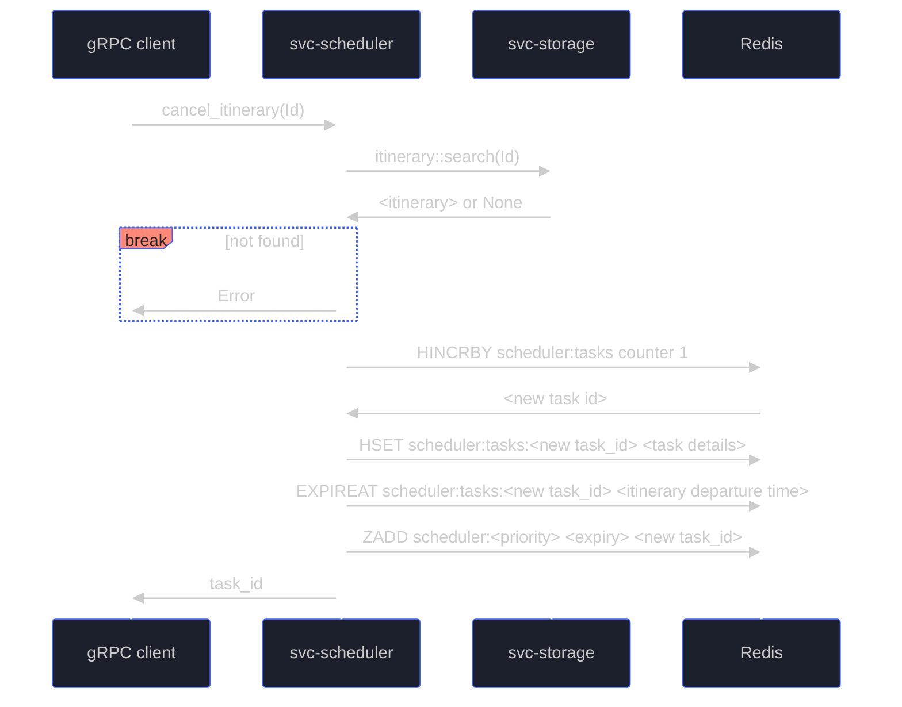
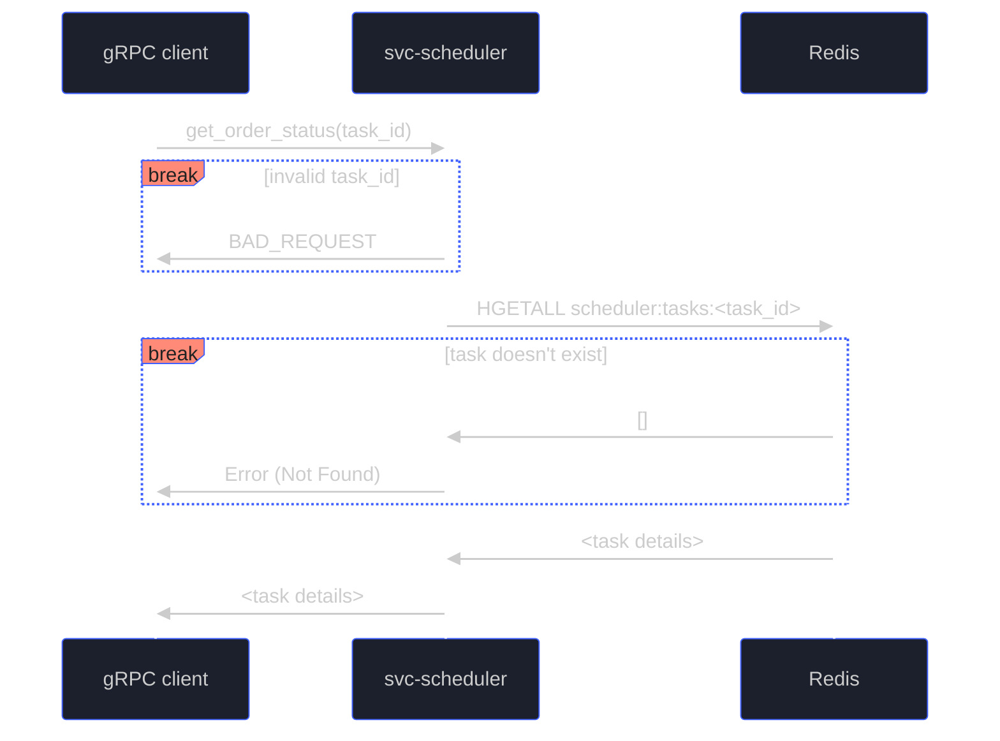
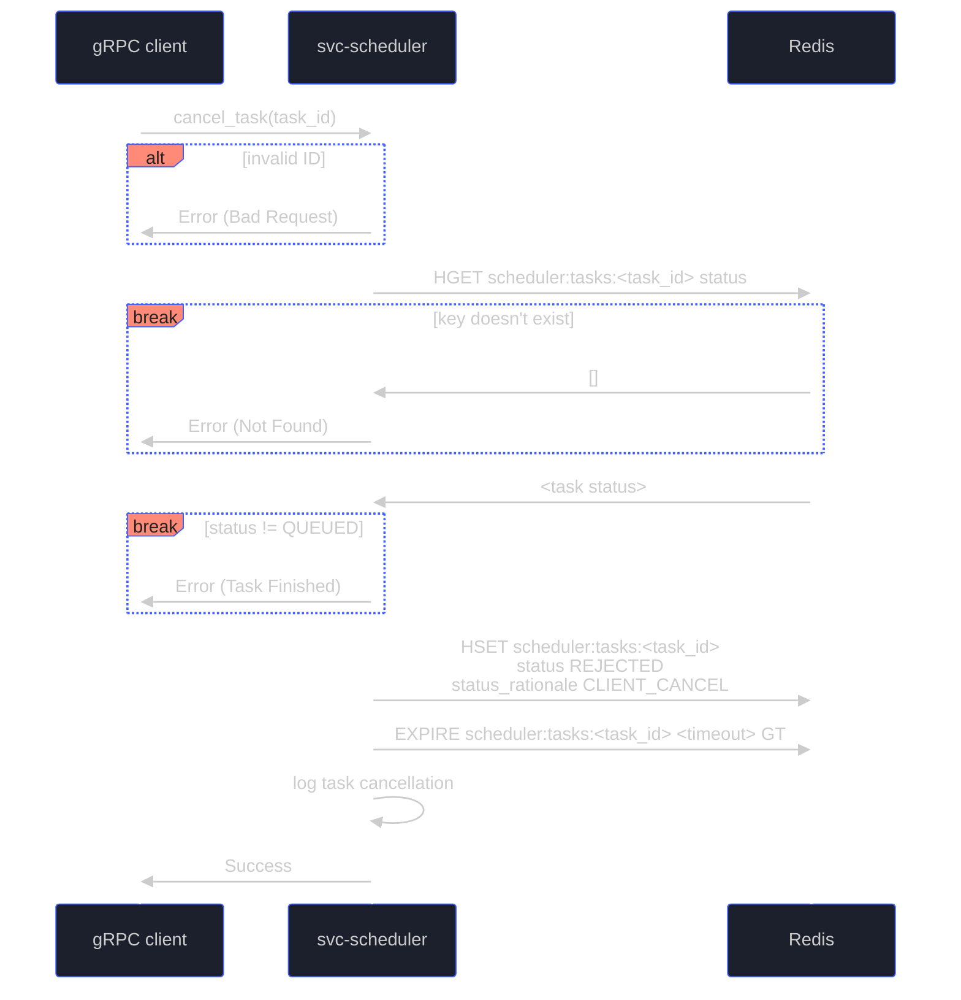
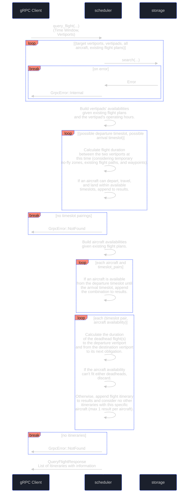

# Software Design Document (SDD) - `svc-scheduler`

## :telescope: Overview

This document details the software implementation of `svc-scheduler` (scheduler module).

The scheduler module is responsible for calculating possible itineraries (including deadhead flights) for a journey between a departure and destination vertipad. It does so with the schedules of all resources (vertiports/pads, aircrafts, pilots) in mind to avoid double-booking.

Created itineraries are saved to storage and can be cancelled. Flight queries, confirmations, and cancellation requests are made by other microservices in the Aetheric network (such as `svc-cargo`).

*Note: This module is intended to be used by other Arrow micro-services via gRPC.*

*This document is under development as Arrow operates on a pre-revenue and pre-commercial stage. Scheduler logics may evolve as per business needs, which may result in architectural/implementation changes to the scheduler module.*

### Metadata

| Attribute     | Description                                                       |
| ------------- |-------------------------------------------------------------------|
| Maintainer(s) | [Aetheric Realm Team](https://github.com/orgs/aetheric-oss/teams/dev-realm) |
| Stuckee       | [Alex M. Smith](https://github.com/amsmith-pro)                   |
| Status        | Development                                                       |

## :books: Related Documents

Document | Description
--- | ----
[High-Level Concept of Operations (CONOPS)](https://github.com/aetheric-oss/se-services/blob/develop/docs/conops.md) | Overview of Aetheric microservices.
[High-Level Interface Control Document (ICD)](https://github.com/aetheric-oss/se-services/blob/develop/docs/icd.md)  | Interfaces and frameworks common to all Aetheric microservices.
[Requirements - `svc-scheduler`](https://nocodb.aetheric.nl/dashboard/#/nc/view/bdffd78a-75bf-40b0-a45d-948cbee2241c) | Requirements and user stories for this microservice.
[Concept of Operations - `svc-scheduler`](./conops.md) | Defines the motivation and duties of this microservice.
[Interface Control Document - `svc-scheduler`](./icd.md)| Defines the inputs and outputs of this microservice.
[Routing Scenarios](https://docs.google.com/presentation/d/1Nt91KVIczhxngurfyeIJtG8J0m_38jGU1Cnqm1_BfPc/edit#slide=id.g1454d6dfbcf_0_731) | Graphical representation of various routing scenarios

## :dna: Module Attributes

| Attribute       | Applies | Explanation                                                                              |
|-----------------|---------|------------------------------------------------------------------------------------------|
| Safety Critical | No      | Scheduler is business critical but has no direct impact to the operational safety.       |
| Realtime        | No      | Scheduler is only used to fetch viable flights, and will not be used during the flights. |

## :gear: Logic

### Environment Variables
The only environment variables are the port numbers used to spin up the server.

For the scheduler server, `DOCKER_PORT_GRPC` is the port number where the server lives. If not provided, `50051` will be used as a fallback port.

For the client, `HOST_PORT_GRPC` is needed to connect to the scheduler server. This env var should be the server's port. If not provided, `50051` will be used as a fallback port. In most cases, one may assume `HOST_PORT_GRPC` to have the same value as `DOCKER_PORT_GRPC`.

### Redis

This microservice makes use of the [Redis sorted set](https://redis.io/docs/data-types/sorted-sets/) and [Redis Hash](https://redis.io/docs/data-types/hashes/) for prioritizing requests.

The following Redis sorted sets will be defined:
- `scheduler:emergency`
- `scheduler:high`
- `scheduler:medium`
- `scheduler:low`

The following Redis hash(es) will be defined:
- `scheduler:tasks`

#### SchedulerTasks

SchedulerTasks result from requests originating within or outside of `svc-scheduler`. The task, when created, is given a unique task ID and stored as a value at `scheduler:tasks:<task_id>`.

All tasks have the following common fields:

| Field | Description | Type |
| --- | --- | --- |
| type | `CANCEL_ITINERARY`, `REROUTE`, `CREATE_ITINERARY` | Enum
| status | `QUEUED`, `REJECTED`, `COMPLETE` | Enum |
| status_rationale | `ID_NOT_FOUND`, `EXPIRED`, `SCHEDULE_CONFLICT`, `CLIENT_CANCELLED`, `PRIORITY_CHANGE` | Enum or nil

The CREATE_ITINERARY and REROUTE tasks will have additional fields containing the departure and arrival vertiports, time windows, and other information needed to plan a journey.

Tasks are marked to expire automatically (a Redis feature) at some time. The duration is usually some time after a task is completed, so that requests for task status are possible for a period after task completion. This is separate from the expiry/score used in the sorted sets, discussed below.

#### Priority Queues (Sorted Set)

After creation, a task ID is pushed into the appropriate sorted set matching its priority level. Sorted sets sort their elements via a "score". In most cases, we provide the departure time of the itinerary as the score so that the nearest events are prioritized first, hopefully before the itinerary is active.

For example, a low priority CANCEL_ITINERARY request may result in a new task with ID `1234` which will then be pushed to the Redis sorted set `scheduler:low`, using the expiry date of the request as the score.

The two commands to Redis would be similar to the following:
```redis
HSET scheduler:tasks:1234 type CANCEL_ITINERARY itinerary_id <UUID> ...
ZADD scheduler:low <2023-10-27T13:20:22+00 as seconds> 1234
```

When task IDs are popped from a sorted set, the ID is used to get the task details from `scheduler:tasks`. If for some reason the task doesn't exist in the hash map (was removed or has expired), a log entry is made and the task is skipped.

### Initialization

The `main` function in [`/server/src/main.rs`](../server/src/main.rs) will spin up a gRPC server at the provided port.

### Control Loop

A single thread will iterate through the redis sorted sets, using the `BZPOPMIN` redis command to get the first item off the top of the priority queues (starting with `scheduler:emergency` and iterating through the rest by descending priority).



Finished tasks are updated in Redis with the result of the action and its rationale, along with any other new information. The expiry date is bumped to allow retrieval for N more hours. This permits task status queries up to some duration after the completion of the task.

Note: In future implementations, opportunities for concurrent actions may be identified. Single thread behavior is simplest to validate for an early prototype of the system with low demand.

#### `cancel_itinerary_impl`
- Cancels an itinerary
- Heals the aircraft schedule gap created by removing an itinerary.
    - This may involve creating a new itinerary (with HIGH priority).



#### `create_itinerary_impl`
- Determines if a provided itinerary is possible
- A possible itinerary can be obtained from the `query_itineraries` gRPC call.



#### `reroute_impl`

:construction: This is not yet implemented.

#### `alter_task_priority_impl`

:construction: This is not yet implemented.

The scheduler or an external client (such as svc-atc, or air traffic control) might need to escalate or de-escalate a task.

- Takes as arguments:
    - The task id
    - The new SchedulerTaskPriority to set

This will mark the given task as REJECTED, create a new task with similar information, and insert the new task ID into the appropriate sorted set.



Notes:
- Notice that we first REJECT the original task before inserting the new task, to not have two concurrently QUEUED tasks for the same flight with different priorities.

### Cleanup

Does not apply.

## :speech_balloon: gRPC Handlers

The gRPC handlers allow the creation, retrieval, or deletion of orders from the `PriorityQueue` or `FinishedMap`.

### `create_itinerary` 
- Client provides UUIDs and timeslots for an aircraft and two vertipads, obtained from `query_itinerary` call.
- Returns an order number if the aircraft and vertiports are valid UUIDs.



### `cancel_itinerary`
- Takes id of an itinerary and cancels all flights associated with that itinerary.




### `get_task_status`
- Takes the id of a task and returns the SchedulerTask record.
- SchedulerTasks that have status `COMPLETE` should also contain the associated itinerary UUID, allowing further requests such as cancel_itinerary().





### `cancel_task`
- Removes a task from the `scheduler:tasks` hash.



### `query_flight` 
- :warning: This does NOT create any tasks or itineraries.
- Takes requested departure and arrival vertiport ids and departure/arrival time window and returns possible itineraries.
- This does not "reserve" any flights, as in earlier releases. In the priority queue system, higher priority requests may invalidate a queried flight.
- Flight information that is returned from this read-only query can be used in a request to create an itinerary, which will be checked for validity when the task is handled in the priority queue control loop.


