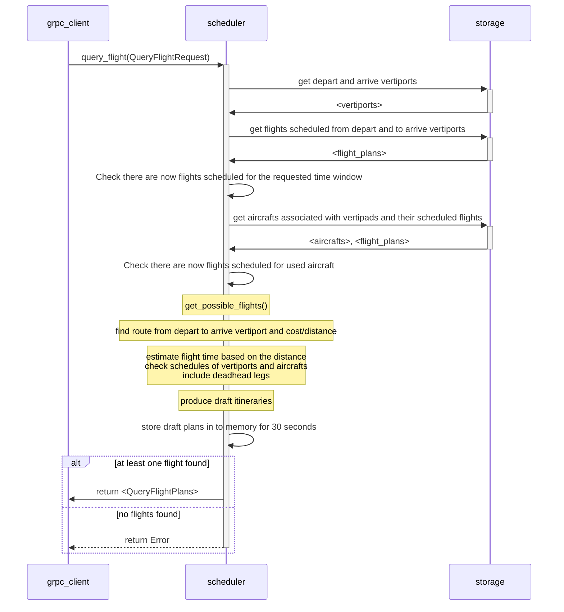
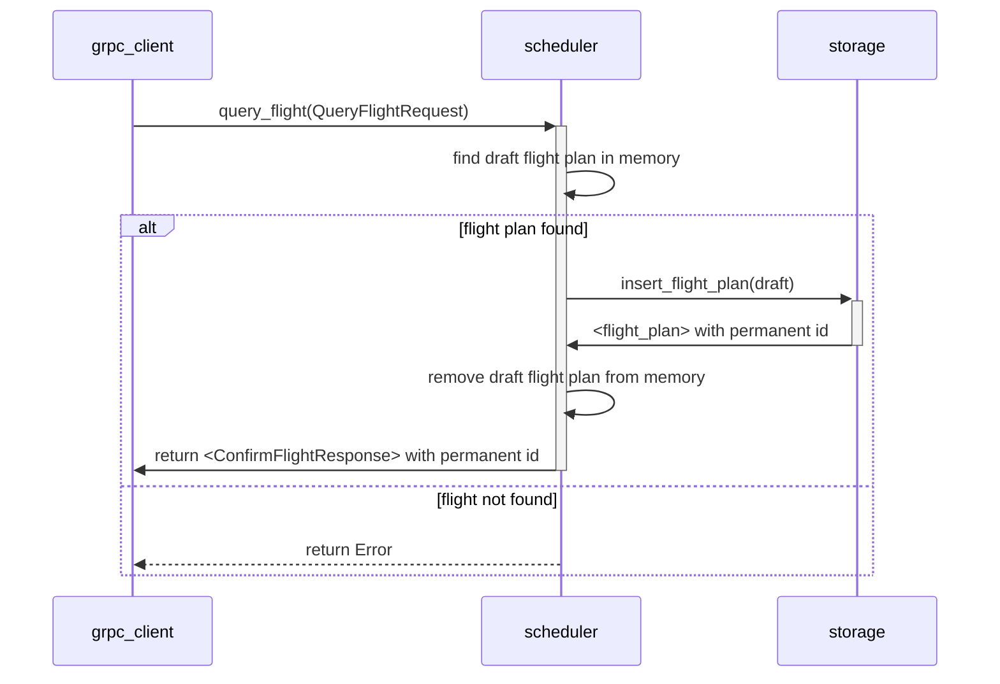
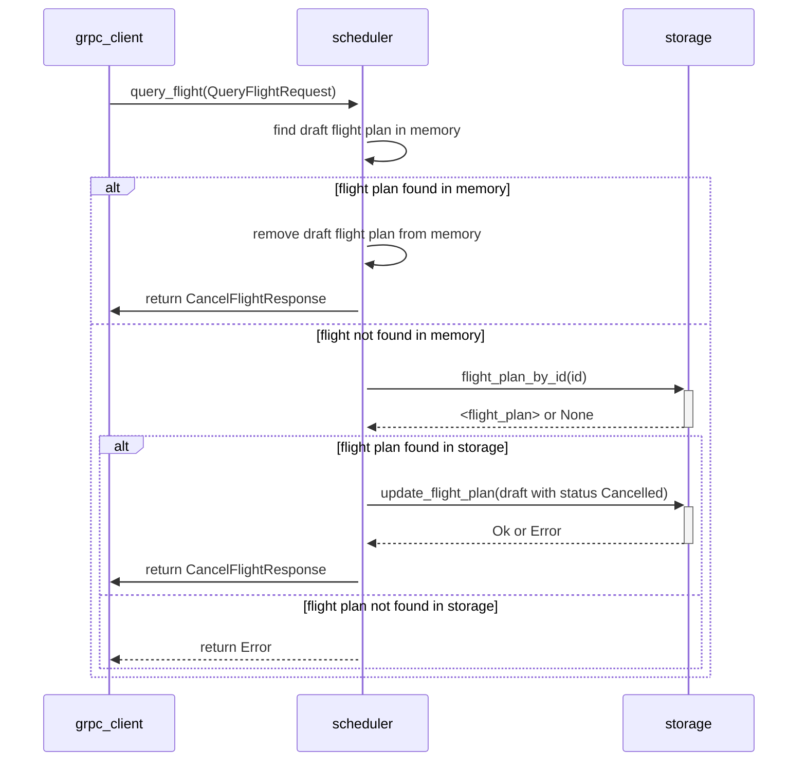

# `svc-scheduler`- Software Design Document (SDD)

### Metadata

| Item | Description                                                       |
| --- |-------------------------------------------------------------------|
| Maintainer(s) | [Services Team](https://github.com/orgs/Arrow-air/teams/services) |
| Primary Contact | [romanmandryk](https://github.com/romanmandryk)                      |

## Overview

Attribute | Description
--- | ---
Status | :yellow_circle: Development

This document details the software implementation of `svc-scheduler` (scheduler module).

The scheduler module is responsible for calculating possible itineraries (including deadhead flights) for a journey between a departure and destination vertipad. It does so with the schedules of all resources (vertiports/pads, aircrafts, pilots) in mind to avoid double-booking.

Draft itineraries are held in memory temporarily and discarded if not confirmed in time. Confirmed flights are saved to storage and can be cancelled. Flight queries, confirmations, and cancellation requests are made by other microservices in the Arrow network (such as `svc-cargo`).

*Note: This module is intended to be used by other Arrow micro-services via gRPC.*

*This document is under development as Arrow operates on a pre-revenue and pre-commercial stage. Scheduler logics may evolve as per business needs, which may result in architectural/implementation changes to the scheduler module.*

## Related Documents

Document | Description
--- | ----
[High-Level Concept of Operations (CONOPS)](https://github.com/Arrow-air/se-services/blob/develop/docs/conops.md) | Overview of Arrow microservices.
[High-Level Interface Control Document (ICD)](https://github.com/Arrow-air/se-services/blob/develop/docs/icd.md)  | Interfaces and frameworks common to all Arrow microservices.
[Concept of Operations - `svc-scheduler`](./conops.md) | Concept of Operations for `svc-scheduler`.
[Interface Control Document - `svc-scheduler`](./icd.md)| Interface Control Document for `svc-scheduler`.
[Requirements - `svc-scheduler`](https://nocodb.arrowair.com/dashboard/#/nc/view/bdffd78a-75bf-40b0-a45d-948cbee2241c) | Requirements for this service.

## Location

Server-side service.

## Module Attributes

| Attribute       | Applies | Explanation                                                                              |
|-----------------|---------|------------------------------------------------------------------------------------------|
| Safety Critical | No      | Scheduler is business critical but has no direct impact to the operational safety.       |
| Realtime        | No      | Scheduler is only used to fetch viable flights, and will not be used during the flights. |

## Logic

### Initialization

This module does not require user-side initialization.

The `main` function in [`/server/src/main.rs`](../server/src/main.rs) will simply spin up the server at the provided port.

### Environment Variables
The only environment variables are the port numbers used to spin up the server.

For the scheduler server, `DOCKER_PORT_GRPC` is the port number where the server lives. If not provided, `50051` will be used as a fallback port.

For the client, `HOST_PORT_GRPC` is needed to connect to the scheduler server. This env var should be the server's port. If not provided, `50051` will be used as a fallback port. In most cases, one may assume `HOST_PORT_GRPC` to have the same value as `DOCKER_PORT_GRPC`.

### Control Loop

Does not apply.

### Cleanup

Does not apply.

## Interface Handlers

See [the ICD](./icd.md) for this microservice.

### `query_flight` 
- Takes requested departure and arrival vertiport ids and departure/arrival time window and returns next available flight(s).

### `confirm_flight` 
- Takes id of the draft flight plan returned from the query_flight and confirms the flight.

### `cancel_flight`
- Takes id of the flight plan (either draft or confirmed) and cancels the flight.

## Tests

### Unit Tests
