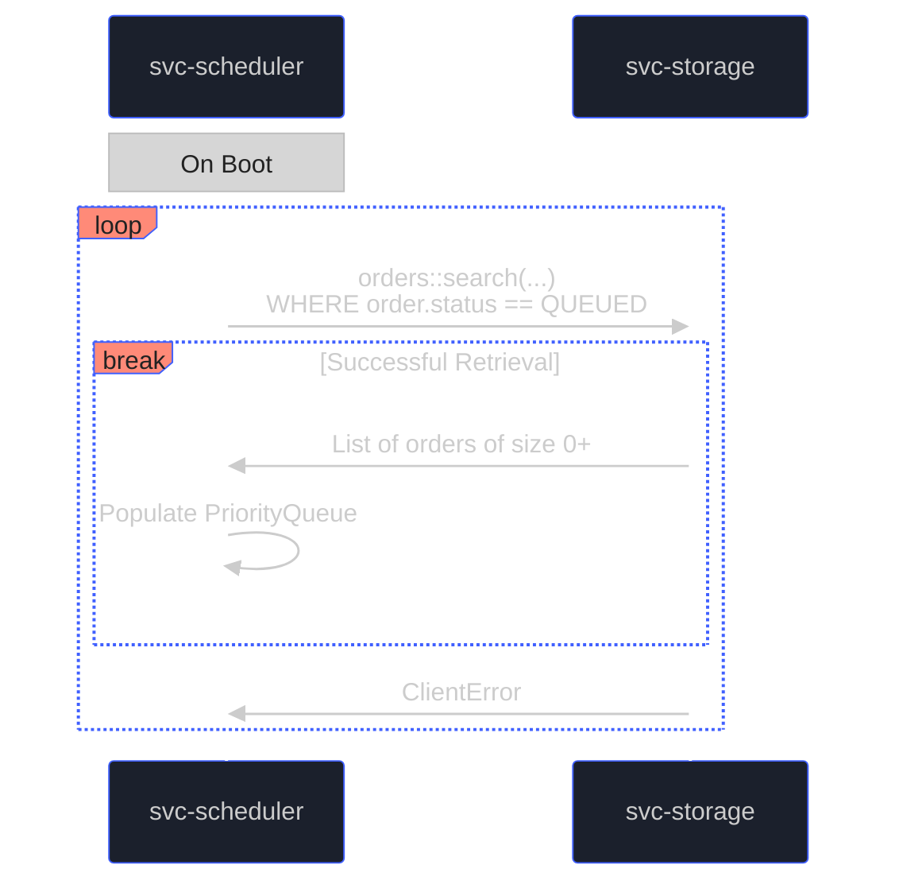
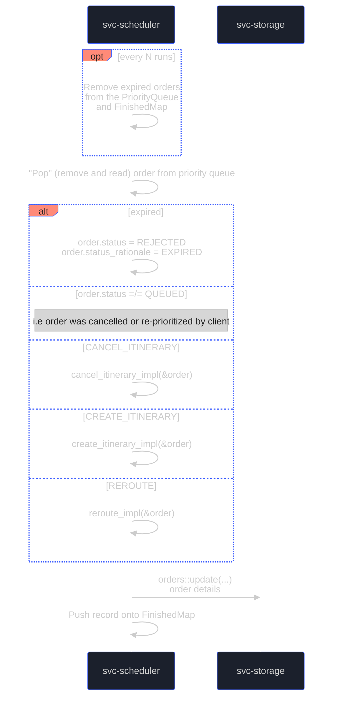
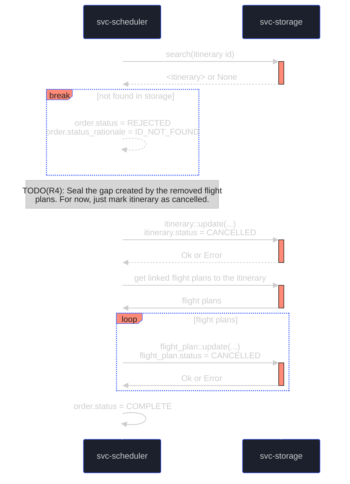
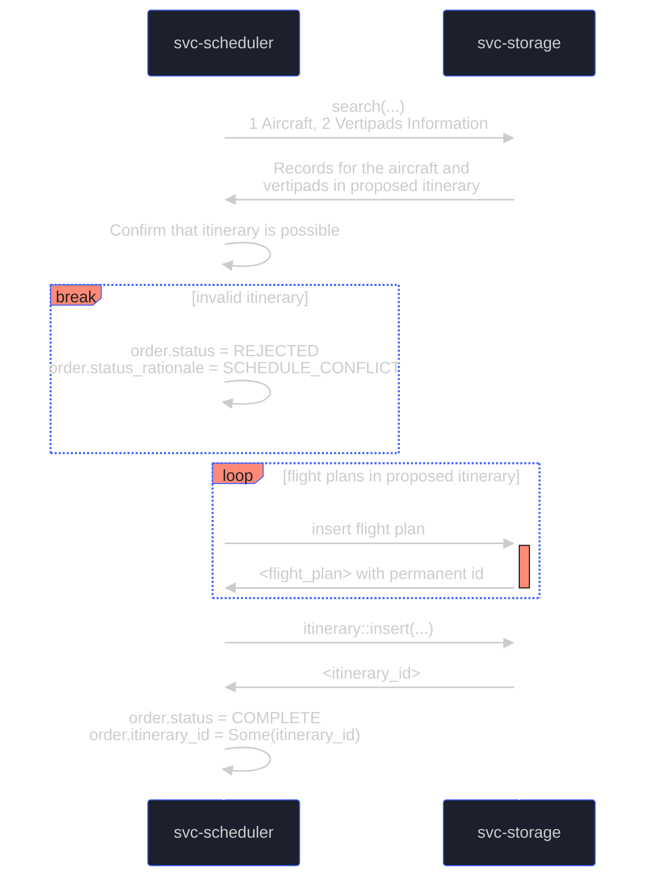
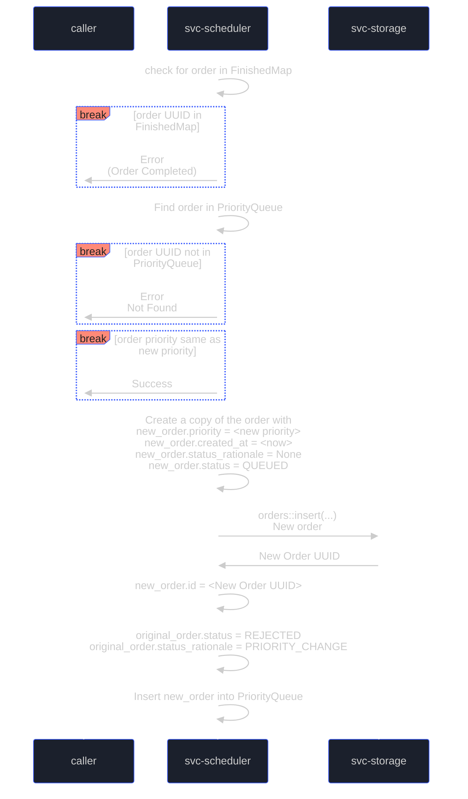
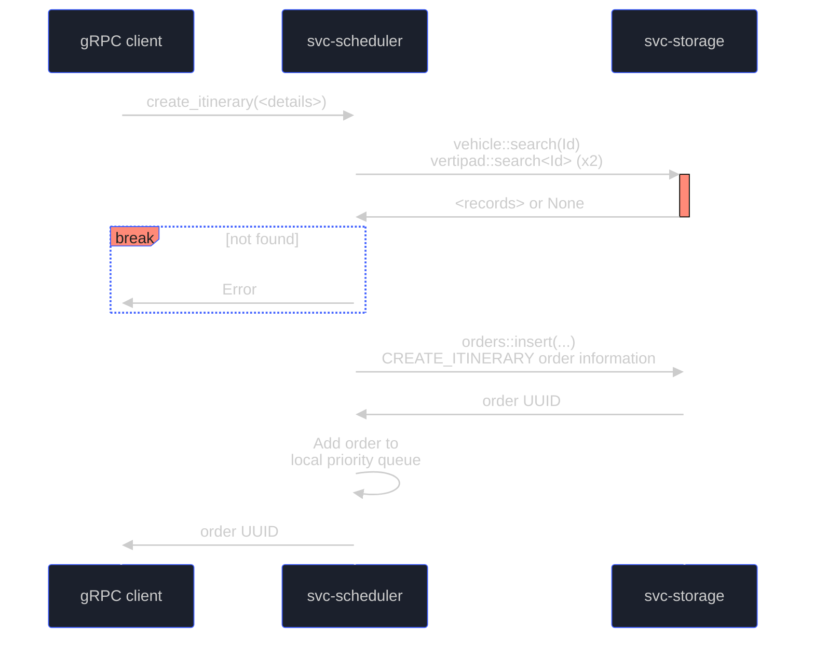
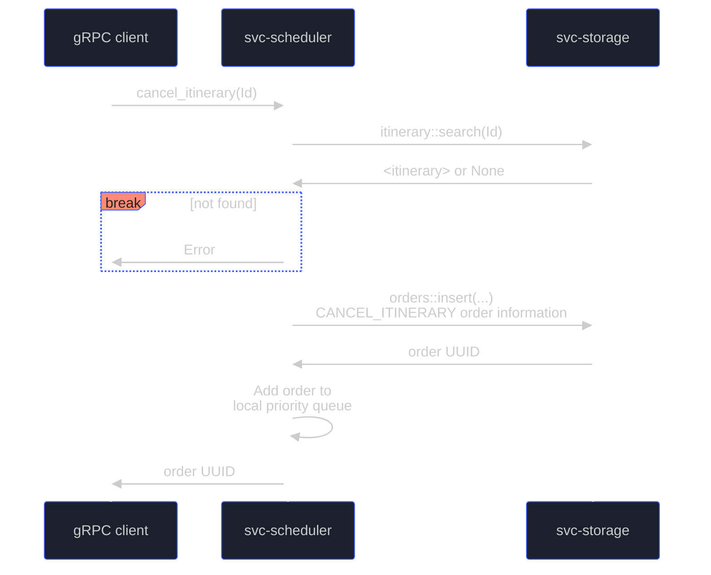
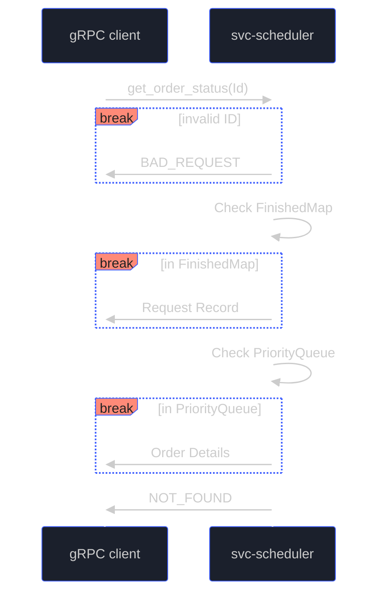
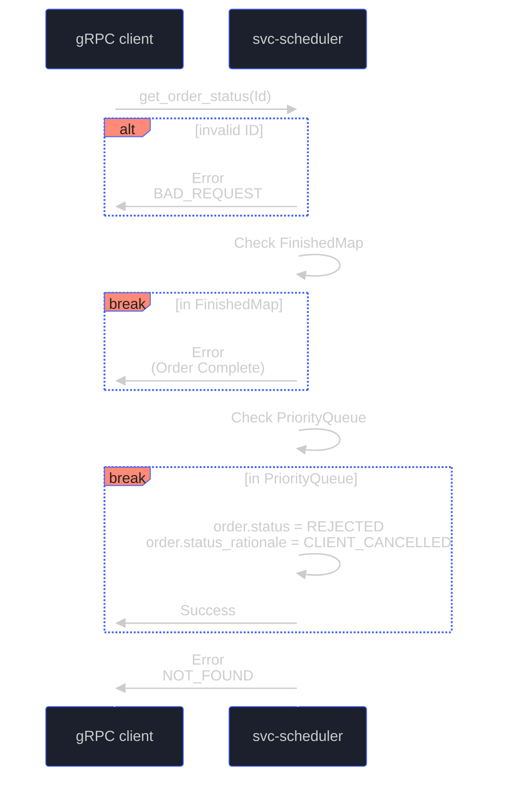
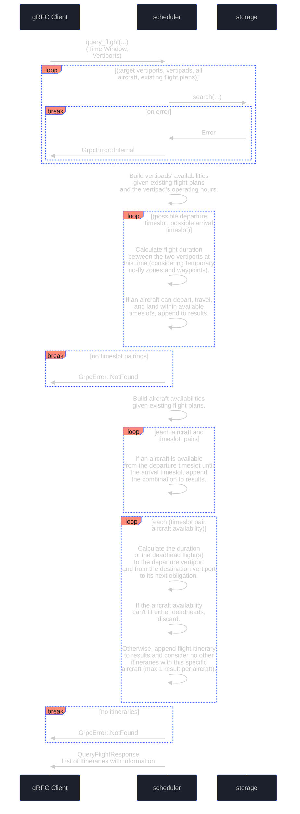

# Software Design Document (SDD) - `svc-scheduler`

## :telescope: Overview

This document details the software implementation of `svc-scheduler` (scheduler module).

The scheduler module is responsible for calculating possible itineraries (including deadhead flights) for a journey between a departure and destination vertipad. It does so with the schedules of all resources (vertiports/pads, aircrafts, pilots) in mind to avoid double-booking.

Draft itineraries are held in memory temporarily and discarded if not confirmed in time. Confirmed flights are saved to storage and can be cancelled. Flight queries, confirmations, and cancellation requests are made by other microservices in the Arrow network (such as `svc-cargo`).

*Note: This module is intended to be used by other Arrow micro-services via gRPC.*

*This document is under development as Arrow operates on a pre-revenue and pre-commercial stage. Scheduler logics may evolve as per business needs, which may result in architectural/implementation changes to the scheduler module.*

### Metadata

| Attribute     | Description                                                       |
| ------------- |-------------------------------------------------------------------|
| Maintainer(s) | [Services Team](https://github.com/orgs/Arrow-air/teams/services) |
| Stuckee       | [Alex M. Smith](https://github.com/servicedog)                   |
| Status        | Development                                                       |

## :books: Related Documents

Document | Description
--- | ----
[High-Level Concept of Operations (CONOPS)](https://github.com/Arrow-air/se-services/blob/develop/docs/conops.md) | Overview of Arrow microservices.
[High-Level Interface Control Document (ICD)](https://github.com/Arrow-air/se-services/blob/develop/docs/icd.md)  | Interfaces and frameworks common to all Arrow microservices.
[Requirements - `svc-scheduler`](https://nocodb.arrowair.com/dashboard/#/nc/view/bdffd78a-75bf-40b0-a45d-948cbee2241c) | Requirements and user stories for this microservice.
[Concept of Operations - `svc-scheduler`](./conops.md) | Defines the motivation and duties of this microservice.
[Interface Control Document - `svc-scheduler`](./icd.md)| Defines the inputs and outputs of this microservice.
[Routing Scenarios](https://docs.google.com/presentation/d/1Nt91KVIczhxngurfyeIJtG8J0m_38jGU1Cnqm1_BfPc/edit#slide=id.g1454d6dfbcf_0_731) | Graphical representation of various routing scenarios

## :dna: Module Attributes

| Attribute       | Applies | Explanation                                                                              |
|-----------------|---------|------------------------------------------------------------------------------------------|
| Safety Critical | No      | Scheduler is business critical but has no direct impact to the operational safety.       |
| Realtime        | No      | Scheduler is only used to fetch viable flights, and will not be used during the flights. |

## :gear: Logic

### Environment Variables
The only environment variables are the port numbers used to spin up the server.

For the scheduler server, `DOCKER_PORT_GRPC` is the port number where the server lives. If not provided, `50051` will be used as a fallback port.

For the client, `HOST_PORT_GRPC` is needed to connect to the scheduler server. This env var should be the server's port. If not provided, `50051` will be used as a fallback port. In most cases, one may assume `HOST_PORT_GRPC` to have the same value as `DOCKER_PORT_GRPC`.

### `Order` Type

An Order is a request to svc-scheduler to perform some action

Orders will have the following metadata in svc-storage, which will convert to a struct in Rust.

| Field | Description | Type |
| --- | --- | --- |
| OrderId | A unique "ticket" number for this request. Clients can query the status of a ticket. Same UUID as the order record in storage. | UUID |
| OrderType | `CREATE_ITINERARY`, `CANCEL_ITINERARY`, `REROUTE` | Enum |
| OrderDetails | Details of this order. Vertiports, aircraft, itineraries to delete, etc. | String (JSON)
| OrderPriority | `EMERGENCY`, `HIGH`, `MEDIUM`, `LOW` | Enum |
| OrderCreatedAt | When this order was created. | DateTime
| OrderExpiry | When this order expires. | DateTime
| OrderStatus | `QUEUED`, `REJECTED`, `COMPLETE` | Enum |
| OrderStatusRationale | `ID_NOT_FOUND`, `EXPIRED`, `SCHEDULE_CONFLICT`, `CLIENT_CANCELLED`, `PRIORITY_CHANGE` | Option\<Enum\>
| OrderItineraryId | If an itinerary is linked to this order (one is created, changed, or deleted), this field should indicate the itinerary UUID. | Option\<UUID\>

Other notes:
-  Emergency requests may only be issued by the network itself, or authorized sources (such as hospitals, government, etc.)

### Initialization

The `main` function in [`/server/src/main.rs`](../server/src/main.rs) will spin up a gRPC server at the provided port.

Additionally, unfulfilled orders will be queried from svc-storage. This is in the event of a reboot or system crash, where unfulfilled emergency orders should be recoverable.

Orders recovered from svc-storage are pushed onto a binary heap that we will refer to as the `PriorityQueue`.

### Control Loop

A single thread will iterate through an order book in local memory, implementing one order at a time.

Finished orders are removed from the `PriorityQueue` and pushed to another temporary collection, referred to as `FinishedMap`, to permit status queries up to some duration after the completion of the order.

Updates to order status will be pushed to svc-storage, so that a system reboot or crash can recover orders that haven't been acted on.

Note: In future implementations, opportunities for concurrent actions may be identified. Single thread behavior is simplest to validate for an early prototype of the system with low demand.

#### `cancel_itinerary_impl`
- Cancels an itinerary
- Heals the aircraft schedule gap created by removing an itinerary.
    - This may involve creating a new itinerary (with HIGH priority).

#### `create_itinerary_impl`
- Determines if a provided itinerary is possible
- A possible itinerary can be obtained from the `query_itineraries` gRPC call.

#### `reroute_impl`

:warning: This is not yet implemented.

#### `alter_order_priority_impl`

The scheduler or an external client (such as svc-atc, or air traffic control) might need to escalate or de-escalate an order.

- Takes as arguments:
    - The UUID of the order
    - The new OrderPriority to set

This will REJECT the given order and insert a QUEUED copy of it (with a new priority and creation time) into the binary heap, where it will traverse upward toward its new position. 

Notes:
- Notice that we don't remove the original order until we're certain we could create the new order.
- Notice that we first REJECT the original order before inserting the new order, to not have two concurrently QUEUED orders for the same flight with different priorities.

### Cleanup

Does not apply.

## :speech_balloon: gRPC Handlers

The gRPC handlers allow the creation, retrieval, or deletion of orders from the `PriorityQueue` or `FinishedMap`.

Order insertions into the `PriorityQueue` will use the following factors (in order) for comparison:
1) OrderPriority
    1) EMERGENCY
    2) HIGH
    3) MEDIUM
    4) LOW
2) OrderExpiry (ascending)
    - Indicates the urgency of the request
3) OrderType
    1) CANCEL_ITINERARY (frees up availability)
    2) REROUTE (potentially active flights)
    3) CREATE_ITINERARY (new flights)
4) OrderCreatedAt (ascending)
    - All else equal, the first request is handled first

An example of the results of this ordering:
| Queue Position | Id | Priority | Type | Expiry | CreatedAt | ...
| --- | --- | --- | --- | --- | --- | -- |
| 0 | ... | EMERGENCY | CREATE_ITINERARY | 2023-10-19T12:59:59 | 2023-10-19T12:32:32 | ...
| 1 | ... | EMERGENCY | REROUTE | 2023-10-19T13:00:00 | 2023-10-19T12:32:32 | ...
| 2 | ... | EMERGENCY | CREATE_ITINERARY | 2023-10-19T13:01:00 | 2023-10-19T12:32:32 | ...
| 3 | ... | MEDIUM | CANCEL_ITINERARY | 2023-10-19T12:01:00 | 2023-10-19T12:00:30 | ...
| 4 | ... | MEDIUM | CANCEL_ITINERARY | 2023-10-19T12:01:00 | 2023-10-19T12:00:31 | ...
| 5 | ... | LOW | REROUTE | 2023-10-19T12:00:00 | 2023-10-19T12:00:31 | ...

### `create_itinerary` 
- Client provides UUIDs and timeslots for an aircraft and two vertipads, obtained from `query_itinerary` call.
- Returns an order number if the aircraft and vertiports are valid UUIDs.

### `cancel_itinerary`
- Takes id of an itinerary (either draft or confirmed) and cancels all flights associated with that itinerary.

### `get_order_status`
- Takes the UUID of an order and returns the Order record.
- If the order is not in the `PriorityQueue` or `FinishedQueue`, return NOT_FOUND.
- Orders that have status `COMPLETE` should also contain the associated itinerary UUID, allowing further requests such as cancel_itinerary().

### `cancel_order`
- Takes the UUID of an order and removes it from the priority queue.

### `query_flight` 
- :warning: This does NOT interact with the `PriorityQueue` or `FinishedMap`.
- Takes requested departure and arrival vertiport ids and departure/arrival time window and returns possible itineraries.
- This does not "reserve" any flights, as in earlier releases. In the priority queue system, higher priority requests may invalidate a queried flight.
- Flight information that is returned from this read-only query can be used in a request to create an itinerary, which will be checked for validity when the order is handled in the priority queue control loop.

